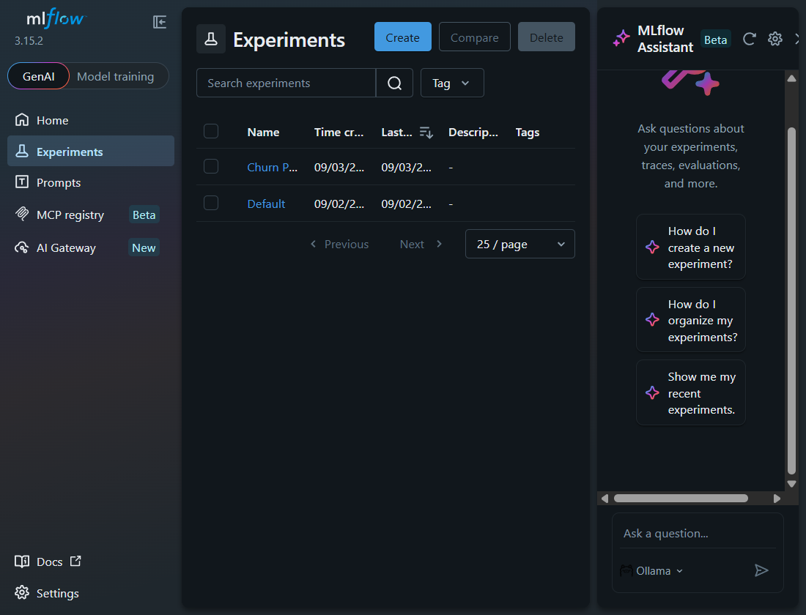
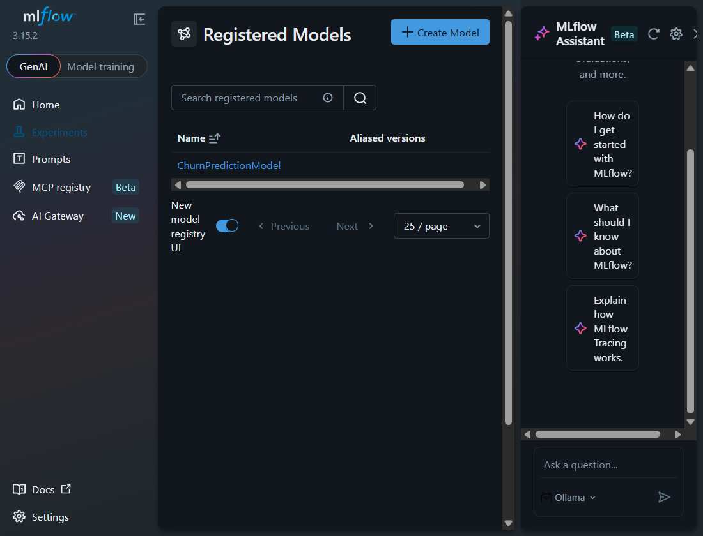
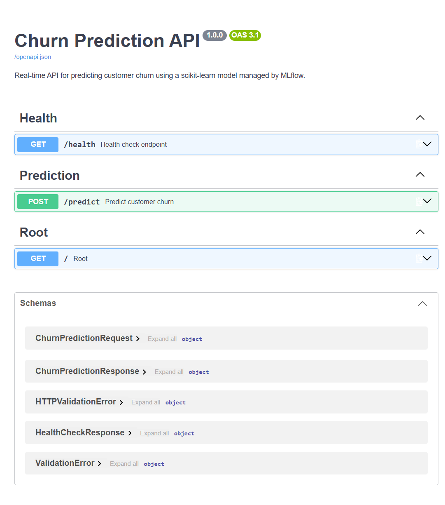

# Churn Prediction API with MLflow

## 📋 Overview

A containerized REST API for customer churn prediction. The project covers model training, experiment tracking, model registration, and deployment through FastAPI and Docker.

### What the project includes

- **Real-time Predictions**: Fast, low-latency REST API for churn predictions
- **MLflow Integration**: Complete experiment tracking and model registry management
- **Model Versioning**: Automatic model versioning and stage management (Production/Staging)
- **Robust Error Handling**: Comprehensive input validation with Pydantic and error responses
- **Containerization**: Multi-stage Docker builds with docker-compose orchestration
- **Scalable Design**: Stateless FastAPI service with configurable MLflow backend
- **Health Monitoring**: Built-in health checks for API and model availability
- **API Documentation**: Auto-generated Swagger UI and OpenAPI schema

### Technology Stack

- **ML Framework**: scikit-learn (Logistic Regression)
- **API Framework**: FastAPI + Uvicorn
- **Model Management**: MLflow (Experiment Tracking & Model Registry)
- **Data Processing**: Pandas + NumPy + scikit-learn
- **Containerization**: Docker + Docker Compose
- **Testing**: Pytest + HTTPx

### Dataset

**Telco Customer Churn** - A publicly available binary classification dataset containing:
- 7,043 customer records
- 20 features (demographics, account info, services)
- Binary target: Churn (Yes/No)

**Source**: [Kaggle - Telco Customer Churn](https://www.kaggle.com/datasets/blastchar/telco-customer-churn)

## Submission Evidence







---

## Quick Start with Docker Compose

### Prerequisites

- **Docker** (v20.10+)
- **Docker Compose** (v2.0+)
- **Git** (for cloning the repository)

### 1. Clone and Setup

```bash
# Clone the repository
git clone https://github.com/vinay-gupta-kandula/churn-prediction-api-mlflow
cd churn-prediction-api-mlflow

# Download the Telco Customer Churn dataset
# Create a data/ directory and place the CSV file there:
# data/WA_Fn-UseC_-Telco-Customer-Churn.csv
# 
# Download from: https://www.kaggle.com/datasets/blastchar/telco-customer-churn
# (You'll need a Kaggle account)
```

### 2. Train the Model

If you have the dataset downloaded, you can train a model before starting the API:

```bash
# Start MLflow first
docker compose up -d mlflow

# Wait for MLflow to be ready
sleep 5

# Train the model and register it in MLflow
docker compose run --rm api python -m src.model.train

# The trained model will be registered in MLflow and automatically picked up by the API
```

### 3. Start the stack

```bash
# Start both services in the background
docker compose up -d

# Check their status
docker compose ps
```

### 4. Verify the services

```bash
# Check API health. The model_status should be "loaded".
curl http://localhost:8000/health

# Example response:
# {"status":"ok","model_status":"loaded","model_version":"3"}

# Access MLflow UI
# Open browser: http://localhost:5000

# Access FastAPI documentation
# Open browser: http://localhost:8000/docs
```

### 5. Make a prediction

```bash
# Example prediction request using named raw customer features
curl -X POST http://localhost:8000/predict \
  -H "Content-Type: application/json" \
  -d '{
   "features": {"gender":"Female", "SeniorCitizen":0, "Partner":"Yes", "Dependents":"No", "tenure":1, "PhoneService":"No", "MultipleLines":"No phone service", "InternetService":"DSL", "OnlineSecurity":"No", "OnlineBackup":"Yes", "DeviceProtection":"No", "TechSupport":"No", "StreamingTV":"No", "StreamingMovies":"No", "Contract":"Month-to-month", "PaperlessBilling":"Yes", "PaymentMethod":"Electronic check", "MonthlyCharges":29.85}
  }'

# The response contains prediction, probability, and model_version.
```

### 6. Stop the services

```bash
# Stop all services
docker compose down

# Remove volumes (deletes MLflow data)
docker compose down -v

# View logs
docker compose logs -f api
docker compose logs -f mlflow
```

### Final verification on Windows PowerShell

The following commands run the same checks used before submission. Run them from the project directory after starting the stack.

```powershell
# Confirm both containers are running and healthy
docker compose ps

# Check the API and the loaded MLflow model
Invoke-RestMethod http://localhost:8000/health

# Check the API documentation endpoints
Invoke-WebRequest http://localhost:8000/docs
Invoke-WebRequest http://localhost:8000/openapi.json

# Send a prediction using the raw Telco customer feature names
$body = @{
   features = @{
      gender = "Female"
      SeniorCitizen = 0
      Partner = "Yes"
      Dependents = "No"
      tenure = 1
      PhoneService = "No"
      MultipleLines = "No phone service"
      InternetService = "DSL"
      OnlineSecurity = "No"
      OnlineBackup = "Yes"
      DeviceProtection = "No"
      TechSupport = "No"
      StreamingTV = "No"
      StreamingMovies = "No"
      Contract = "Month-to-month"
      PaperlessBilling = "Yes"
      PaymentMethod = "Electronic check"
      MonthlyCharges = 29.85
   }
} | ConvertTo-Json

Invoke-RestMethod `
   -Uri http://localhost:8000/predict `
   -Method Post `
   -ContentType "application/json" `
   -Body $body

# Confirm the environment template is present
Test-Path .\.env.example
```

The prediction response should include `prediction`, `probability`, and `model_version`. The version number will change when a newer model is registered.

---

## 🏗️ Local Development Setup

### Prerequisites

- **Python** 3.9+
- **pip** or **conda**
- **MLflow** running locally or remote server

### Step 1: Virtual Environment

```bash
# Create virtual environment
python -m venv venv

# Activate (Windows)
venv\Scripts\activate

# Activate (Linux/Mac)
source venv/bin/activate
```

### Step 2: Install Dependencies

```bash
pip install -r requirements.txt
```

### Step 3: Start MLflow Server (in a separate terminal)

```bash
# Local file-based backend (SQLite)
mlflow ui --host 0.0.0.0 --port 5000

# Access at: http://localhost:5000
```

### Step 4: Train Model (with your dataset)

```bash
# PowerShell: set the MLflow tracking URI for this terminal
$env:MLFLOW_TRACKING_URI="http://localhost:5000"

# Place dataset at: data/WA_Fn-UseC_-Telco-Customer-Churn.csv

# Run training script
python -m src.model.train

# Model will be logged and registered in MLflow automatically. The saved
# sklearn pipeline includes preprocessing, so it can accept raw CSV columns.
# Check MLflow UI for experiments and registered models
```

### Step 5: Run FastAPI Server

```bash
# In a new PowerShell terminal
$env:MLFLOW_TRACKING_URI="http://localhost:5000"
$env:MLFLOW_MODEL_NAME="ChurnPredictionModel"
$env:MLFLOW_MODEL_STAGE="Production"

python -m uvicorn src.api.main:app --reload --host 0.0.0.0 --port 8000
```

### Step 6: Test the API

```bash
# Health check
curl http://localhost:8000/health

# Make prediction with a named raw feature object
curl -X POST http://localhost:8000/predict \
  -H "Content-Type: application/json" \
   -d '{"features": {"gender":"Female", "SeniorCitizen":0, "Partner":"Yes", "Dependents":"No", "tenure":1, "PhoneService":"No", "MultipleLines":"No phone service", "InternetService":"DSL", "OnlineSecurity":"No", "OnlineBackup":"Yes", "DeviceProtection":"No", "TechSupport":"No", "StreamingTV":"No", "StreamingMovies":"No", "Contract":"Month-to-month", "PaperlessBilling":"Yes", "PaymentMethod":"Electronic check", "MonthlyCharges":29.85}}'

# Access Swagger UI
# Open browser: http://localhost:8000/docs
```

### Step 7: Run Tests

```bash
# Unit tests for model/preprocessing
pytest tests/test_model.py -v

# Integration tests for API
pytest tests/test_api.py -v

# All tests
pytest tests/ -v --cov=src
```

---

## 📊 API Endpoints

### 1. Health Check

```http
GET /health
```

**Description**: Check API and model health status.

**Response** (200 OK - Model Loaded):
```json
{
  "status": "ok",
  "model_status": "loaded",
  "model_version": "1"
}
```

**Response** (503 Service Unavailable - Model Not Loaded):
```json
{
  "detail": "Model not loaded or unavailable. Check MLflow connection and model registry."
}
```

---

### 2. Predict Churn

```http
POST /predict
```

**Description**: Predict customer churn from named raw customer features. The deployed sklearn pipeline performs preprocessing during inference.

**Request Body**:
```json
{
   "features": {
      "gender": "Female", "SeniorCitizen": 0, "Partner": "Yes", "Dependents": "No",
      "tenure": 1, "PhoneService": "No", "MultipleLines": "No phone service",
      "InternetService": "DSL", "OnlineSecurity": "No", "OnlineBackup": "Yes",
      "DeviceProtection": "No", "TechSupport": "No", "StreamingTV": "No",
      "StreamingMovies": "No", "Contract": "Month-to-month", "PaperlessBilling": "Yes",
      "PaymentMethod": "Electronic check", "MonthlyCharges": 29.85
   }
}
```

**Response** (200 OK):
```json
{
  "prediction": 1,
  "probability": 0.75,
  "model_version": "1"
}
```

**Response** (400 Bad Request - Invalid Input):
```json
{
  "detail": "Invalid input data: ..."
}
```

**Response** (503 Service Unavailable - Model Not Loaded):
```json
{
  "detail": "Prediction model is not available. Please check the API logs."
}
```

---

## 🏛️ Architecture Overview

### System Architecture

```
┌─────────────────────────────────────────────────────────────┐
│                     Docker Host                             │
│                                                             │
│  ┌──────────────────────┐      ┌──────────────────────┐   │
│  │   FastAPI Service    │      │   MLflow Server      │   │
│  │   (Port 8000)        │      │   (Port 5000)        │   │
│  │                      │      │                      │   │
│  │  • /health           │  ←→  │ • Model Registry     │   │
│  │  • /predict          │      │ • Experiment Track   │   │
│  │  • /docs (Swagger)   │      │ • Artifact Store     │   │
│  │                      │      │                      │   │
│  └──────────┬───────────┘      └──────────┬───────────┘   │
│             │                             │                │
│             │                    ┌────────▼────────┐      │
│             │                    │   mlruns.db     │      │
│             │                    │   (SQLite)      │      │
│             │                    └─────────────────┘      │
│             │                                             │
│             │        ┌─────────────────────────┐         │
│             └───────→│   Shared Network        │         │
│                      │   (churn_network)       │         │
│                      └─────────────────────────┘         │
└─────────────────────────────────────────────────────────────┘
```

### Data Flow

```
1. Data Preparation
   ├─ Load raw data (CSV)
   ├─ Handle missing values
   ├─ Encode categorical features (OneHotEncoder)
   ├─ Scale numerical features (StandardScaler)
   └─ Package preprocessor with classifier in one sklearn Pipeline

2. Model Training (src/model/train.py)
   ├─ Split data (80/20 train/test)
   ├─ Train Logistic Regression model
   ├─ Evaluate on test set (accuracy, precision, recall, F1)
   └─ Log to MLflow:
      ├─ Parameters (solver, max_iter, etc.)
      ├─ Metrics (accuracy, F1-score, etc.)
      ├─ Model artifact (scikit-learn model)
      └─ Register in Model Registry

3. API Inference (src/api/main.py)
   ├─ Startup: Load latest Production model from MLflow
   ├─ Receive: POST /predict with named raw customer features
   ├─ Validate: Pydantic request model
   ├─ Predict: Pipeline transforms raw fields and calls predict_proba
   ├─ Respond: JSON with prediction + probability + version
   └─ Handle: Validation errors, model unavailability

4. Containerization
   ├─ Dockerfile.api: Multi-stage build for FastAPI service
   ├─ Dockerfile.mlflow: MLflow tracking server container
   └─ docker-compose.yml: Orchestrate and network services
```

### MLflow Workflow

```
Training Phase:
1. Start training run (mlflow.start_run())
2. Log hyperparameters (mlflow.log_param())
3. Train model
4. Log metrics (mlflow.log_metric())
5. Log model artifact (mlflow.sklearn.log_model())
   └─ Registered as: ChurnPredictionModel (version: 1, 2, ...)
6. Transition to Production stage (client.transition_model_version_stage())

Inference Phase:
1. Load model from registry: models:/ChurnPredictionModel/Production
2. Parse request payload
3. Make prediction
4. Return prediction + model version
```

---

## 🧪 Testing

### Test Coverage

The project includes comprehensive test suites:

#### Unit Tests (tests/test_model.py)
- **Data Preprocessing**: Loading, encoding, scaling consistency
- **Data Splitting**: Train/test split validation
- **Model Training**: Model fitting and evaluation

```bash
pytest tests/test_model.py -v
```

#### Integration Tests (tests/test_api.py)
- **Health Endpoint**: Model loaded/not loaded states
- **Prediction Endpoint**: Valid/invalid inputs, error handling
- **API Documentation**: Swagger UI and OpenAPI schema accessibility

```bash
pytest tests/test_api.py -v
```

#### Run All Tests with Coverage

```bash
pytest tests/ -v --cov=src --cov-report=html
```

---

## 🐛 Troubleshooting

### Model Not Loading

**Problem**: API returns 503 Service Unavailable for predictions.

**Solutions**:
1. Verify MLflow server is running:
   ```bash
   curl http://localhost:5000
   ```
2. Check MLflow has trained models:
   - Open http://localhost:5000 → Check Experiments tab
   - Ensure a model exists with name "ChurnPredictionModel" in Production stage
3. Verify environment variables:
   ```bash
   echo $MLFLOW_TRACKING_URI
   echo $MLFLOW_MODEL_NAME
   echo $MLFLOW_MODEL_STAGE
   ```
4. Check API logs:
   ```bash
   docker-compose logs api
   ```

### Dataset Not Found

**Problem**: `FileNotFoundError: data/WA_Fn-UseC_-Telco-Customer-Churn.csv`

**Solution**: 
1. Download from Kaggle: https://www.kaggle.com/datasets/blastchar/telco-customer-churn
2. Place file in `data/` directory:
   ```bash
   mkdir -p data/
   # Copy CSV file here
   ls data/WA_Fn-UseC_-Telco-Customer-Churn.csv
   ```

### Port Already in Use

**Problem**: Docker fails to bind to port 5000 or 8000.

**Solution**:
```bash
# Kill existing process or use different ports
# Edit docker-compose.yml: change "5000:5000" to "5001:5000", etc.

# Or kill process:
# Windows
netstat -ano | findstr :5000
taskkill /PID <PID> /F

# Linux/Mac
lsof -i :5000
kill -9 <PID>
```

### Prediction Returns 400 Bad Request

**Problem**: API rejects valid-looking input.

**Reason**: The deployed model expects named raw customer fields.

**Solution**: 
1. Use the named raw-feature example in the Swagger UI.
2. Include all required fields shown in the model signature.

---

## 🎯 Design Choices & Trade-offs

### 1. Model Selection: Logistic Regression
- **Why**: Simple, interpretable, fast inference, MLflow-compatible
- **Trade-off**: Lower accuracy vs. complex models (RF, XGBoost)
- **Justification**: Project focus is MLOps, not model complexity

### 2. Data Preprocessing Strategy
- **Choice**: ColumnTransformer with OneHotEncoder + StandardScaler
- **Why**: Consistent preprocessing between training and inference
- **Solution**: The registered artifact is an sklearn Pipeline containing both preprocessing and the classifier, preventing training/inference drift.

### 3. MLflow Backend: SQLite + File Artifacts
- **Why**: Simple, no external DB required, sufficient for development/testing
- **Trade-off**: Not ideal for production at scale (single writer)
- **Production Alternative**: PostgreSQL backend + S3/GCS artifact store

### 4. API Input Format: Named Raw Fields
- **Choice**: Accept the original customer columns as a JSON object.
- **Why**: The request is readable and matches the MLflow model signature.
- **Trade-off**: Clients must provide the expected field names and types.
- **Compatibility**: Direct CSV-row JSON is accepted, including numeric strings from PowerShell `Import-Csv`.

### 5. Docker Compose for Orchestration
- **Why**: Simple, suitable for development and small deployments
- **Trade-off**: Not production-grade (use Kubernetes for scale)
- **Production Alternative**: Docker Swarm, Kubernetes, cloud-managed services

### 6. No Database for Predictions
- **Design**: Stateless API, all state in MLflow
- **Why**: Scalability, simplicity, no persistence needed
- **Future**: Add optional logging/analytics database for audit trail

---

## 📈 Performance Considerations

### Inference Performance
- **Model Load Time**: ~2-5 seconds (cached after startup)
- **Prediction Latency**: ~10-50ms per request (depends on feature dimension)
- **Throughput**: ~1000+ requests/second (limited by CPU, network)

### Scaling Recommendations
1. **Horizontal**: Run multiple API containers behind load balancer
2. **Vertical**: Increase CPU/memory allocation
3. **Caching**: Cache frequently predicted features/results
4. **Batch Inference**: Add `/batch_predict` endpoint for bulk predictions

---

## 🚀 Deployment to Production

### Pre-deployment Checklist

- [ ] All tests passing (`pytest tests/ -v`)
- [ ] Model evaluated on validation set (F1-score > 0.7)
- [ ] Model transitioned to Production stage in MLflow
- [ ] Environment variables configured for production MLflow backend
- [ ] Health checks verified for all services
- [ ] Error logging enabled and monitored
- [ ] API documentation reviewed and complete

### Deployment Steps

1. **Use Kubernetes** (recommended):
   ```bash
   kubectl apply -f k8s-manifests/
   ```

2. **Use Docker Compose** (development/small scale):
   ```bash
   docker-compose -f docker-compose.prod.yml up -d
   ```

3. **Configure Production MLflow**:
   - Use PostgreSQL or RDS for backend store
   - Use S3, GCS, or Azure Blob for artifacts
   - Enable authentication and SSL

4. **Set Up Monitoring**:
   - Prometheus + Grafana for metrics
   - ELK stack for logging
   - Alerts for model/API failures

5. **Implement CI/CD**:
   - GitHub Actions / GitLab CI for automated testing
   - Auto-build and push Docker images
   - Automatic deployment on main branch

---

## 📚 References & Resources

### MLflow Documentation
- [MLflow Official Docs](https://mlflow.org/docs/latest/index.html)
- [MLflow Model Registry](https://mlflow.org/docs/latest/model-registry.html)
- [MLflow Python API](https://mlflow.org/docs/latest/python_api/index.html)

### FastAPI & Uvicorn
- [FastAPI Documentation](https://fastapi.tiangolo.com/)
- [Pydantic Documentation](https://docs.pydantic.dev/)
- [Uvicorn Documentation](https://www.uvicorn.org/)

### Docker & Docker Compose
- [Docker Best Practices](https://docs.docker.com/develop/dev-best-practices/)
- [Docker Compose Reference](https://docs.docker.com/compose/compose-file/)

### scikit-learn
- [scikit-learn Documentation](https://scikit-learn.org/stable/)
- [Model Selection & Evaluation](https://scikit-learn.org/stable/modules/model_evaluation.html)

### Dataset
- [Telco Customer Churn - Kaggle](https://www.kaggle.com/datasets/blastchar/telco-customer-churn)

---

## 📝 Project Structure

```
churn-prediction-api-mlflow/
├── src/
│   ├── __init__.py
│   ├── api/
│   │   ├── __init__.py
│   │   ├── main.py              # FastAPI application
│   │   └── models.py            # Pydantic request/response models
│   ├── data/
│   │   ├── __init__.py
│   │   └── preprocess.py        # Data loading and preprocessing
│   └── model/
│       ├── __init__.py
│       ├── train.py             # Training with MLflow
│       └── predict.py           # Prediction utilities
├── tests/
│   ├── __init__.py
│   ├── test_model.py            # Unit tests
│   └── test_api.py              # Integration tests
├── data/                        # Dataset directory (add CSV here)
├── Dockerfile.api               # FastAPI service image
├── Dockerfile.mlflow            # MLflow server image
├── docker-compose.yml           # Service orchestration
├── requirements.txt             # Python dependencies
├── .env.example                 # Example environment variables
├── README.md                    # This file
└── .gitignore
```

---

